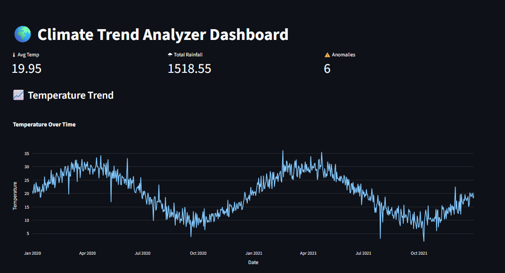
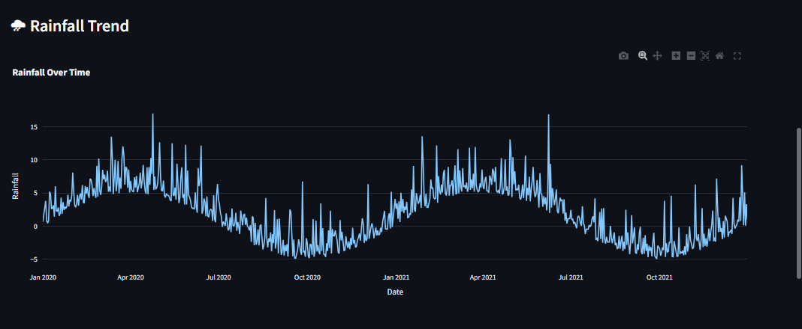
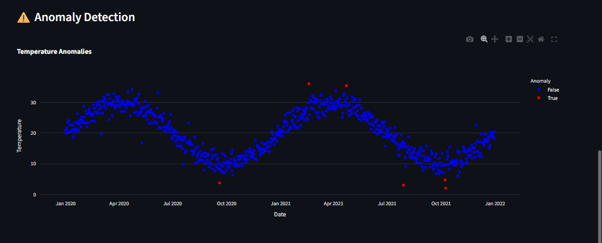
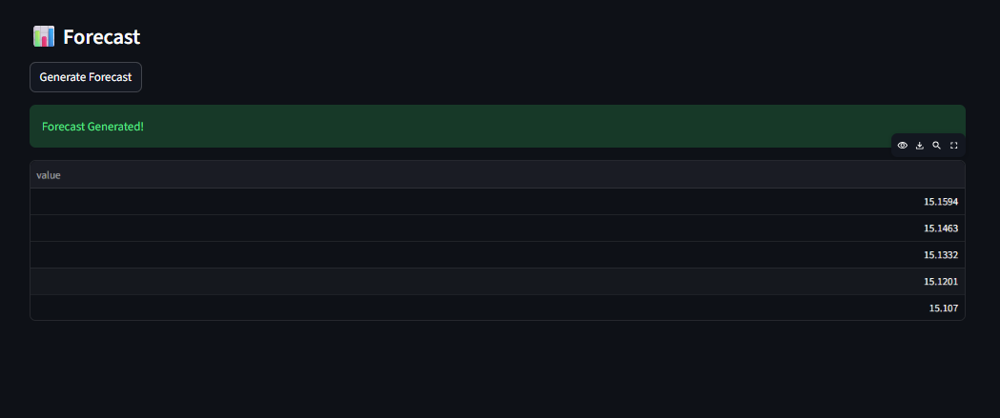

## Climate Trend Analyzer

## Overview

An end-to-end data science system designed to analyze climate data, identify long-term trends, and detect anomalies using statistical and machine learning techniques.

This project simulates real-world climate analytics scenarios and provides actionable insights through data analysis and visualizations.

## Problem Statement

Climate analysis faces multiple challenges:
• Large and complex datasets
• Difficulty in identifying long-term trends
• Seasonal variations and anomalies
• Lack of clear visualization for decision-making

## Solution

This system uses data science techniques to:
• Analyze historical climate data
• Identify temperature and rainfall trends
• Detect anomalies in climate patterns
• Generate meaningful visual insights

## Key Features

• End-to-end pipeline (Data → Preprocessing → Analysis → Visualization)
• Synthetic climate data simulation
• Time-series trend analysis
• Anomaly detection
• Forecasting (basic)
• Clean and modular project structure

## Visualization Preview

• Temperature Trend: outputs/plots/results/temperature_trend.png

• Rainfall Trend: outputs/plots/results/rainfall_trend.png

• Anomaly Detection: outputs/plots/results/anomaly_plot.png

## Sample Output

• Input: Historical climate dataset
• Output: Trend graphs, anomaly detection plots, and insights

## Tech Stack

• Python
• Pandas, NumPy
• Matplotlib / Seaborn
• Scikit-learn
• Statsmodels

## Project Structure

Climate-Trend-Analyzer/
│
├── data/
│   ├── processed/
│   │   └── climate_cleaned.csv
│   ├── raw/
│   │   └── climate_data.csv
│   └── simulation/
│       └── generate_data.py
│
├── notebooks/
│   └── eda.ipynb
│
├── outputs/
│   └── plots/
│       ├── anomaly_plot.png
│       ├── rainfall_trend.png
│       └── temperature_trend.png
│
├── src/
│   ├── analysis.py
│   ├── anomaly.py
│   ├── data_loader.py
│   ├── forecast.py
│   └── preprocessing.py
│
├── main.py
├── requirements.txt
└── README.md

## Interactive Dashboard

## How It Works

• Climate data is loaded from raw dataset or generated using simulation
• Data preprocessing is performed (cleaning, formatting)
• Exploratory analysis is conducted to understand patterns
• Trend analysis identifies long-term changes
• Anomaly detection highlights unusual values
• Forecasting predicts future climate behavior
• Results are visualized through graphs

## How to Run

1. Install dependencies

pip install -r requirements.txt

2. Run main pipeline

python main.py

3. View outputs

outputs/plots/

## Future Improvements

• Region-wise climate comparison
• Real-time climate data integration
• Advanced forecasting (ARIMA, LSTM)
• Interactive dashboard (Streamlit)

## Author

Nikhat Jahan
GitHub: https://github.com/Nikhatjahan85

